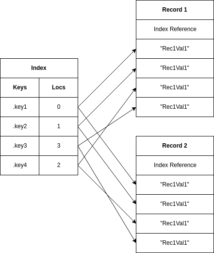
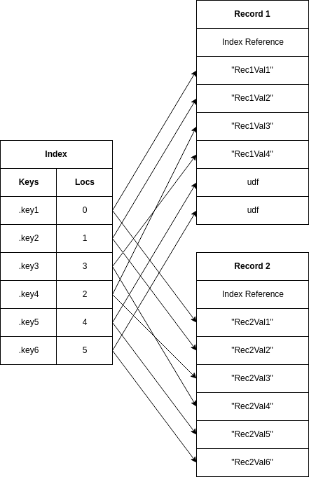

# Ten Language Guide
This guide is intended as a quick intro to the Ten programming
language.  Since the language itself is quite small and pretty
intuitive, this brief intro should go a good way toward outlining
Ten's capabilities and style.

* [About Ten](#about-ten)
* [Setting Up](#setting-up)
  - [Installation](#installation)
  - [Troubleshooting](#troubleshooting)
  - [Hello, World!](#hello-world)
* [Types](#types)
    - [Undefined](#undefined)
    - [Nil](#nil)
    - [Logical](#logical)
    - [Integral](#integral)
    - [Decimal](#decimal)
    - [Symbol](#symbol)
    - [String](#string)
    - [Record](#record)
    - [Closure](#closure)
    - [Fiber](#fiber)
    - [Tuple](#tuple)
    - [Other Types](#other-types)
    - [Type Checking](#type-checking)
    - [Type Conversion](#type-conversion)
* [Operators](#operators)
* [Variables and Fields](#variables-and-fields)
    - [Definition](#definition)
    - [Mutation](#mutation)
    - [Fields](#fields)
* [Record Explosion](#record-explosion)
* [Conditional Expressions](#conditional-expressions)
  - [Replacement](#replacement)
  - [Short-Circuit Logic](#short-circuit-logic)
* [Block Expressions](#block-expressions)
* [Signals and Handlers](#signals-and-handlers)
* [Iteration](#iteration)
  - [Iterators](#iterators)
* [Strings and Text](#strings-and-text)
* [Lists](#lists)
* [Compiling](#compiling)
* [User IO](#user-io)
* [Modules](#modules)
  - [Script Modules](#script-modules)
  - [Native Modules](#native-modules)
  - [Data Modules](#data-modules)
* [That's All Peeps](#thats-all-peeps)

## About Ten
Ten is a general purpose scripting language designed from the
ground up for simplicity.  The language is designed around two
ideals:

  1. _That elegance is achieved through simplicity_.  Elegant
     code is simple, readable, intuitive; and while a simple
     language doesn't enforce the creation of such code, it
     certainly discourages writing of the needlessly complex
     by omitting many of the gadgets thoughtlessly used in
     its creation.

  2. _A language should stay out of the coder's way_.  That is,
     a good language doesn't bloat the mind with 'features' that
     try to do your work for you, but more often just give you
     extra to consider and reason about.  A language should
     provide a minimal tool-set and let you focus on the problem
     itself instead of all the flashy gadgets.

That said, Ten isn't the be-all and end-all of languages, and
it doesn't try to be.  Ten is a _scripting_ language, good for
writing semi-disposable code quickly and easily; not so good
at anything needing a lower abstraction level or amazing
performance.

The idea behind Ten isn't particularly unique, several existing
languages place emphasis on simplicity and minimalism, it does
however feature its own unique style, without the compatibility
baggage of older languages; and a few original ideas including
the useful semantics of `udf` values and the state sharing
properties of records.

## Setting Up
Before getting into the meat of the language, we'd better setup
a common working environment to keep us on the same page.  The
core Ten language itself is implemented as a library, which
isn't practical for our purposes of demonstration and exploration.
The official CLI (Command Line Interface) for Ten, on the other
hand, is much more suitable.  Unfortunately the CLI depends on
POSIX functionality, so Windows users will need some form of
abstraction layer like [Cygwin](https://www.cygwin.com/).

The CLI is packaged with some supplementary libraries in addition
to the core Ten language with its builtin functions; this guide
will only cover the core language features, along with a brief
exploration of the [ten-load](https://github.com/raystubbs/ten-load)
module loading system which is also included with the CLI.

### Installation
Ten's CLI, along with the language implementation itself, currently
isn't at a stable enough point in development to warrant binary
distributions for any platform.  But installation from source is
quite painless:

    git clone --recursive https://github.com/raystubbs/ten-cli
    cd ten-cli
    make
    sudo make install

Assuming that is, that a GNU toolchain is being used for the build,
otherwise you'll need to compile everything manually for now; since
it's all standard C compilation shouldn't be difficult if you're
versed in the tools.

If bandwidth or storage is limited, and you'd rather not clone
the full repo then you'll need to download the following and
manually organize them into the indicated file tree:

* [ten-cli](https://github.com/raystubbs/ten-cli/archive/master.zip)
  - [ten-lang](https://github.com/raystubbs/ten-lang/archive/master.zip)
  - [ten-load](https://github.com/raystubbs/ten-load/archive/master.zip)

Then do the same as above, omitting the `git clone`.

### Troubleshooting
The first step after installation is to make sure everything works, try:

    ten --version

This should print something to the effect of:

    Ten 0.2.0
    License MIT
    Copyright (C) 2019 Ray Stubbs

If that's what you get, great, we're good to go.  Otherwise, check
through the following trouble cases.

#### Case 1
If you get message to the effect of:

    bash: ten: command not found...

Then the CLI executable isn't in your path.  Ten installs to the
`/usr/local/` directory subtree, and some systems don't have this
setup properly for execution by default.  To fix this issue you'll
need to add the `/usr/local/bin/` directory to the `PATH`
environment variable.  This can be done temporarily with:

    export PATH=$PATH:/usr/local/bin/

Unfortunately however, this is localized to the current terminal,
and will reset when it's closed.  For something more permanent
you'll need to add this line to your shell's profile script.

Try running the test line again, if you get the same error...
then something's really broken, you can submit an issue
[here](https://github.com/raystubbs/ten-cli/issues) and it'll
be worked on.  If you see a different error message then
look through the rest of the cases, chances are if you had
trouble with this one then [Case 2](#case-2) will also be
an issue.

#### Case 2
If you get a message similar to:

    ten: error while loading shared libraries: libten.so: cannot open shared object file: No such file or directory

Then the library installation directories `/usr/local/lib/`
and `/usr/local/lib64/` need to be added to the library path,
usually `LD_LIBRARY_PATH`, but for Mac this is `PATH`.  For
a temporary solution we can do:

    export LD_LIBRARY_PATH=$LD_LIBRARY_PATH:/usr/local/lib/:/usr/local/lib64/

This however only sets the variable in the current terminal,
and it'll be reset when it's closed.  For something more
permanent you'll need to add this line to your shell's profile
script.

Try running the test line again, if you get the same error...
then something's really broken, you can submit an issue
[here](https://github.com/raystubbs/ten-cli/issues) and it'll
be worked on.  If you see a different error message then
look through the rest of the cases.

### Hello, World!
For the sake of tradition... let's do this first.  We'll do
two versions, a REPL and a script to demonstrate
both aspects of the CLI.

A REPL can be launched by just running `ten` with no arguments,
you'll be presented with a prompt.  Submitting `"Hello, World!"`
will just print the same value back out:

    ten
    $ "Hello, World!"
    : "Hello, World!"

Now create a script file `hello.ten` containing:

    show( "Hello, World", N )

And run it:

    ten hello.ten
    Hello, World!

The CLI will be used in examples and demonstrations throughout
the guide; and is a useful tool for exploring the semantics
not detailed in this guide.

---

## Types
Ten is a dynamically, but strongly, typed language.  This means
that types are checked at runtime rather than compile time, and
variables can hold values of any type; but the language
won't automatically convert between similar types of value.

While most of Ten's type system and the types themselves are
pretty standard; there are a few exceptions of note.

One such exception is the lack of any list or array type;
like Lua, from which Ten derives several ideas, Ten only
has one type of compound value, a hash-map-like structure
called a record.  The reason for this omission is, of course,
simplicity.  Records with numeric keys can, for the most part,
be used in place of these more specialized containers; and
for larger data sets (which records aren't great with) we
can use LISP style linked lists composed of record cells.

Another oddity in Ten's type system is the `udf` (undefined)
value, which is distinct from `nil`.  While many languages have
some form of 'empty value' singleton such as these; not many two
different such values.  And those that do, such as JavaScript,
assign no special semantics to either of these.  In Ten, however,
the `udf` value represents something that's unknown or missing,
while `nil` is just an empty placeholder value.  The distinction
here is important, as the former is usually an indication of some
kind of error, while the latter is just a normal value; and the
semantics are designed accordingly.  While `nil` can be passed
around and used like any other value; `udf` is given special
consideration, it can't be passed as a function call argument
and is restricted in several other ways to allow for early
discovery of related bugs.

Type names are given as symbols with three letter abbreviations
abbreviations of the full type name.  The type name for a value
can be obtained with the `type()` function, for example:

    $ type( 123 )
    : 'Int'
    $ type( 1.2 )
    : 'Dec'

### Undefined
As mentioned above, this is the singleton type for the value `udf`,
used to represent missing or unknown values.  The shortened type
name is `Udf`, and values of this type have special restriction
on how they can be used, to prevent the values themselves from
becoming bugs.

The `udf` value is not allowed to be passed as a function argument,
a record key, or a predicate to any type of conditional expressions;
and can only be passed as an operand to specialized operators, all
of which begin in `!` to clarify that its operands may contain `udf`.

In addition, since the `udf` value is returned for undefined
variable references, and undefined variables themselves can
be said to 'hold' this value; it's given special semantics
when assigned to variables.

When an existing variable is defined to `udf`, the variable itself
becomes undefined, and can thus no longer be captured by closures;
mutations however are not allowed to set a variable's value to `udf`.

### Nil
This is the 'normal' counterpart to `Udf`.  This has a the shortened
type name `Nil` and is the singleton type for the value `nil`.  The
`nil` value represents nothing, an empty value; and is useful as
a placeholder value without the special properties of `udf`.

### Logical
This is your standard boolean type, though named differently.  It
covers the `true` and `false` values.

### Integral
A 32 bit signed integer type.  Represented syntactically in the usual
way, a sequence of contiguous digits.  Ten also allows the digits of
a number to be padded with '\_' after the first digit, so `1_000_000`
is the same as `1000000`.

Ten doesn't have any syntax for numbers in alternative bases.  So
hex, octal, and binary numbers have to be parsed from string with
the `hex()`, `oct()`, and `bin()` functions respectively.

    $ hex"FFF"
    : 4095
    $ oct"777"
    : 511
    $ bin"111"
    : 7

### Decimal
A 64 bit double precision float type.  Represented syntactically in
the usual way; though exponent suffixes aren't supported.  As with
integrals, we can also pad the number with '\_' to help with
readability, so `1_000.0` is the same as `1000.0`.

The above-mentioned functions for parsing numbers of alternate bases
work for parsing decimals as well, just include a decimal point in
the number:

    $ hex"F.F"
    : 15.937500
    $ oct"7.7"
    : 7.875000
    $ bin"1.1"
    : 1.500000

### Symbol
Symbols are similar to strings, but not the same.  Unlike strings,
symbols are interned at compile time (or creation time), for fast
constant time comparison.  This makes them suitable for use as
enumerations or flags, but they aren't as efficient to create as
strings, and require more memory.

Shorter symbols (< 5 bytes) are encoded directly into a value's
payload instead of in an intern pool; so they can be created
really efficiently and require very little memory, so they're
also great for representing multi-byte characters.

Symbols are represented syntactically as a sequence of characters
between single quotes `'...'`.  The terminating quote can, however,
be omitted at the end of a line, in which case the line end
terminates the symbol literal.

    'this is a symbol'
    'this is another

An alternative quoting syntax can be used for multi-line symbols,
or symbols that need to contain a quote character.

    '|this is a symbol with a  ' character|'
    '|this is a symbol with
    two lines|'  

### String
This is your standard string type.  The syntactic representation
is similar to that of symbols, but double quotes are used instead.

    "this is a string"
    "this is another"
    "|this is a string with a " character"|
    "|this is a string with
    two lines|"

### Record
Records are Ten's counterpart to the hash maps of similar
languages.  Record constructors consist of a sequence of
key-value pairs enclosed in curly brackets `{...}`.  The
entries are delimited by `,` comma or `\n` newline, and
one or more of these can appear between entries.  The
beginning and end of the record can also optionally be
padded by some number of delimiters.

    { @'k1': 'v1', @'k2': 'v2' }

Record keys consist of a `@` followed by some primary expression
to be evaluated for the key's value.  In this case we just give
the key literally, but it could also be computed.

We can also use a bit of sugar for symbol keys, replacing the `@`
with a `.` and giving the symbol as an identifier.

    { .k1: 'v1', .k2: 'v2' }

Or we can omit the keys entirely, leaving Ten to assign them
automatically:

    { 'a', 'b' }

Implicit keys are assigned as integral keys beginning at `0`
and increment from left to right, so the above is equivalent
to:

    { @0: 'a', @1: 'b' }

Explicit and implicit keys can be combined in a single record,
however while not enforced, it's good practice to give all
implicit keys first, followed by explicit ones.

    { 'a', 'b', .k1: 'v1', .k2: 'v2' }

Whether this practice is observed or not, explicit keys are
ignored when assigning the values of implicit ones.

Record fields can be accessed with the same kinds of key
markers used in the constructor, only used as infix operators
between the record and key itself.

    def myRec: { .k1: 'v1', .k2: 'v2' }
    def myVal1: myRec.k1
    def myVal2: myRec@'k2'

It's essential to realize that while records _are_ a form of hash
map, they aren't designed to be used in the same way as their
counterparts in other languages.  Records are designed for memory
efficiency, and if used correctly allow for massive savings.  But
if used carelessly a lot of resources will be wasted.

Ten's record design isolates the lookup table into an independent
unit, an index, which can be shared amongst several records.  This
means each record doesn't have to have its own lookup table, the
largest portion of a map; but can instead share this state with
other records that have a similar set of keys, esentially reducing
the record to a relatively small array of values.

This design is, however, a double edged sword.  Since multiple
records are sharing a single index, each of them must allocate
enough value slots for all keys in the index.  So if the record
don't share the same set of keys, then there ends up being a
lot of empty slots; which amounts to wasted memory.

The compiler assigns each record constructor an index, which will
be shared between all the records it constructs.  Since records
will often be used as object or struct like entities, which are
generally uniform amongst all instances; this is a pretty sane
approach.  However as might be expected, there are exceptions;
in some cases the records created by a common constructor will be
more diverse, with very different fields.  For such cases the
record should be 'separated' from its original index with the `sep()`
function.  This cuts ties between the record and its current index,
creating a new index with only the record's subset of keys; and
allowing new keys to be added without polluting the common index.

    def myRec: sep{ .k1: 'v1', .k2: 'v2' }

The `sep()` function takes a record as input, and _marks_ it as
separated, before returning the same record.  This doesn't
expend the work needed to create and populate a new index, instead
after being marked the record will be given its new index on the
next definition, if one ever occurs.  This 'lazy separation' is
ideal since it often can't be anticipated whether a record's
structure will be modified or not.  It's generally good practice
for library routines that return records to the user to mark
them in this way beforehand, to prevent index pollution in case
the user decides the modify them.

### Closure
Closures are first class functions, that can access their lexical
environment; that is, the variables in scope when the closure was
created.

This is Ten's only type of function, or callable object, and we'll
often just call them functions; though in some contexts the
distinction is relevant, since functions are actually another type
of object that serves the same purpose as indices do for records;
they contain the parts of a closure that can be shared between all
instances. But, ironically, raw functions can't be called directly,
and will rarely be seen at all in Ten.

Closure constructors begin with a parameter list, enclosed in `[...]`
with the same delimiter system as used in record constructors.
Following the parameter list comes a single expression, which serves
as the closure's body, and whose result is returned as the result
of a call.

    [ a, b ] a + b

Some number of 'padding' delimiters are allowed to appear between
the parameter list and result expression, so we could also say:

    [ a, b ]
      a + b

Or, using a block expression (which will be detailed later), a
closure can be given the more traditional 'body' as a block of
code:

    [ a, b ] do
      ...
    for a + b

We don't have a special syntax for function definitions, instead
just assign a closure to a variable:

    def add: [ a, b ] a + b

For direct assignments like this, a closure on the right hand side
and a single variable on the left; Ten will set the 'name' of the
closure as the variable's name, which will be used to create
better error messages.

To call a closure we use the 'invisible' call operator, which
as higher precedence than the path operators (`@` and `.`).  This
operator is recognized by the appearance of two consecutive
expressions, without another operator in between them.

    $ def id: [ v ] v
    : udf
    $ id 123
    : 123
    $ id "hello"
    : "hello"
    $ id id
    : <Cls>

For functions that accept multiple arguments, we pass them as
a tuple; which consists of a number of delimited values between
parentheses.

    $ add( 1, 2 )
    : 3

It's also good practice to wrap single arguments that don't have
their own grouping syntax (e.g `"..."`, `{...}`, `[...]`) in
parentheses to highlight the function call:

    $ id( 123 )
    : 123

#### Variadic Parameters
In some cases it may be useful to allow a function to take an
arbitrary number of arguments; for example consider a `sum()`
function, which adds all its arguments to produce the sum. This
can be achieved with a variadic parameter, which can be given
as the last parameter in the list:

    def sum: [ vals... ] addAllTheValues( vals )

Any extra arguments passed to a call to the function, that is
arguments after the last non-variadic parameter's position,
will be put into a record, and passed in place of the `vals`
parameter.  These extra arguments are assigned keys based
on their position after the `vals` parameter's location, so
for example if we call:

    sum( 4, 3, 2, 1 )

Then `4` will be put under the key  `@0`, `3` under the key `@1`,
and so on.  The variadic records created for each function call
all share the same index, so don't pollute it.

#### Recursion
One of the main issues with not having a dedicated function
definition syntax is that recursion can't be done in the usual
way.  If we say something like:

    def foo: [] foo()

Then, since the right hand expression is evaluated before the
definition, `foo` is undefined when the closure is created,
and so isn't captured by the closure.  So `foo()` is undefined
within the closure.

    $ def foo: [] foo()
    : udf
    $ foo()
    Error: Attempt to call non-Cls type Udf
      unit: ???        line: 1    file: <REPL>              
    $

We can overcome this by first defining `foo` to a `nil` value
to allow for capture by a closure, then setting it to the closure
itself:

    def foo: nil
    set foo: [] foo()

But this is awkward and redundant.  Instead Ten has a special `this`
variable which is defined for each closure, and contains a reference
to the current closure being evaluated.  So instead of the above, we
can say:

    def foo: [] this()

And... don't call that function ;)  The `this` variable is read-only,
so attempts at definition or assignment will result in compilation
failure.

### Fiber
Fibers are an essential part of Ten's execution model, though they'll
often be invisible; all code is evaluated on a fiber.  These are light
weight threads that allow for a degree of concurrency, though without
any parallel execution.

Fibers allow the execution state of individual tasks to be isolated
from one another; allowing each task to be paused and continued on
demand, and preventing errors that occur in one task from propagating
to the rest of the program; in this sense serving as a form of
exception handling device.

Unlike records and closures, there's no language level fiber
constructor, instead we use the `fiber()` function to wrap a
task (a closure) in a fiber.

    def f: fiber[ a, b ] a + b

A fiber can be started, or continued, with the `cont()` function.
This accepts any arguments to be forwarded to the fiber as an
additional record parameter, and returns the result of evaluating
the fiber's closure.

    $ cont( f, { 10, 5 } )
    : 15

Once the wrapped closure returns (the task if finished) the
wrapping fiber is set into the `finished` state, and can no
longer be continued, since it has nothing to do.  The state
of a fiber can be obtained with the `state()` function.

    $ state( f )
    : 'finished'

#### Error Handling
One of the most useful features of fibers is that they prevent
internal errors from propagating to the rest of the program.  An
error that prevents a fiber from finishing its task, only halts
that one fiber, and allows the rest of the program to continue
on.

For example say we have the fiber:

    def d: [ a, b ] a / b

Ten throws an error on division by zero:

    $ 15/0
    Error: Division by zero
      unit: ???        line: 1    file: <REPL>

But if we evaluate the same, within its own fiber, then the
error never interferes with the greater program.

    $ cont( d, { 15, 0 } )
    : ()

There's no result because of the error, but no error message
either.  Instead the fiber is put in a failed state.

    $ state( d )
    : 'failed'

And its error value (usually a message) can be obtained with:

    $ errval( d )
    : "Division by  zero"

For more verbosity we can even obtain the stack trace generated
when the error occurred, as a record of trace nodes.

    $ trace( d )
    : { { .line: 1, .file: '<REPL>' } }

This is, of course, more useful for script files; since giving `<REPL>`
as the source file isn't particularly helpful.

In general minor errors should avoid using fibers as exception
handlers, some sort of return code or extra 'error' return (as
is done in Go) should be preferred.  But for more critical errors
or bad input, the `panic()` function can be called to throw a
user error:

    $ def p: fiber[] panic"Something broke"
    : udf
    $ cont( p, {} )
    : ()
    $ state( p )
    : 'failed'
    $ errval( p )
    : "Something broke"

#### Yield and Continue
Their application to exception handling isn't the only useful
property of fibers.  As mentioned before, a fiber can be
started or continued with `cont()`, but fibers can also be
paused on demand, to be continued later.

The `yield()` function stops execution of a fiber, causing
the `cont()` call that had continued the fiber to return
the arguments of the yield, for example:

    $ def y: fiber[] yield( 123 )
    : udf
    $ cont( y, {} )
    : 123

At this point the fiber will be in the stopped state, since it's
execution was stopped by the yield.

    $ state( y )
    : 'stopped'

When the fiber is next continued, the continuation arguments (those
forwarded from the `cont()` call) will serve as the return values
for the previous `yield()` call.  So if we continue this fiber
again with an argument, the argument will serve as the closure's
ultimate return value, and the return of the continuation since
this is the task's return value.

    $ cont( y, 321 )
    : 321

Now the wrapped closure has returned, so the fiber is finished:

    $ state( y )
    : 'finished'

This functionality is especially useful in conjunction with
asynchronous IO, as a task can be paused while waiting for input,
then continued upon receipt of the requested data; allowing other
processing to be done in the meantime.  A task scheduler is
required, however, to use this strategy effectively; and the core
language doesn't provide one since it'd enlarge the implementation
and can't be implemented without some platform specific code.

The choice of a scheduler implementation is thus left to the user,
though the Ten CLI will likely ship with one in the future.

### Tuple
Tuples aren't really a 'type' like all the others mentioned, at
least not a first class type.  Tuples are a means of grouping
multiple temporary values to pass as arguments or return values.
They exist only on the temporary stack, and can't be nested or
assigned to variables or record fields.

Tuples are expressed syntactically as some number of expressions
nested between parentheses `(...)`.  Single values and single
value tuples are equivalent, so parentheses can also be used for
controlling evaluation precedence as usual.

    ()
    ( 1 )
    ( 1, 2 )
    ( 1, 2, 3 )

The delimiter rules are the same here as for record constructors.
The size of tuples is limited to 32 values; this is necessary for
the compiler to figure out the maximum number of stack slots a
function might need at call time to avoid the overhead of checking
stack boundaries on each temporary allocation.

### Other Types
Though we've covered Ten's most prominent types, the language does
have a few other value types not detailed so far.  These types aren't
especially important when programming in Ten, and will rarely be seen
or used.  But they're more important from the perspective of an embedding
application, so will be covered in more detail in the embedding guide.

* Index

  This is the type given to the shared lookup tables used by records.

* Function

  This is the type given to the portion of closures that can be shared
  between instances.

* Pointer

  This is the type given to native memory addresses.  Though Ten
  doesn't know how to do anything with pointers, they can be passed
  to native functions, to which the pointer will be more useful.

* Data

  This is the type of native user objects.  They contain a block
  of raw memory to be used by native functions, and a set of member
  associated member variables.

### Type Checking
Besides the `type()` function for obtaining a value's type name,
Ten also features a specialized `expect()` function for type
checking; which panics if the given value isn't of the expected
type.

    def val: 123
    expect( "val", 'Int', val )

The first argument gives a 'unit' to report as not having the
proper type, in this case just the name of the variable, this
is used in the generated error message.

    $ def val: 123
    : udf
    $ expect( "val", 'Dec', val )
    Error: Wrong type Int for 'val', need Dec
      unit: ???        line: 1    file: <REPL>              
      unit: ???        line: 428  file: src/ten_lib.c

In addition to the basic type abbreviation, values of some
types can be 'tagged' with further type information.  Records
are tagged just by adding a `.tag` field:

    $ def r: { .tag: 'Example' }
    : udf
    $ type( r )
    : 'Rec:Example'

Tags can also be specified for type checking, but if omitted then
only the base type will be checked.

    $ expect( "r", 'Rec:Example', r )
    : ()

Other 'taggable' types are Dat (data objects) and Ptr (pointers),
but these can only be tagged from native code, so an explanation
will be given in the embedding guide.

    $ expect( "p", 'Ptr:SomeType', p )
    : ()
    $ expect( "d", 'Dat:SomeType', d )
    : ()

### Type Conversion
Ten provides a few functions for converting between some of the
simpler types; since Ten is strongly typed this won't happen
implicitly as it would in weaker typed languages.  Type conversion
happens as might be expected, logical values can be converted to
numbers as `false -> 0` and `true -> 1`, strings and symbols can
be parsed for literals of the target type, and any type can be
stringified as a string or literal.  If for some reason the conversion
cannot succeed, then `udf` is returned.

    $ log( 1 )
    : true
    $ int"123"
    : 123
    $ dec( "not a number" )
    : udf
    $ sym( 3.14 )
    : '3.14'
    $ str( 1.2 )
    : "1.2"

---

## Operators
Ten's operators are mostly pretty standard in both syntax and meaning.
There are however, a few exceptions.  And it's important to remember
that Ten is a strongly typed language, so if unexpected types or type
combinations are passed to any of the operators then Ten will throw an
error rather than attempting an implicit type conversion.

At this point Ten doesn't support any operator overloading.  Though
it's a possibility in the future; I'm hesitant to add such functionality
due to the abuse this system has seen in other languages, so changes
are it'll never be realized.  A reasonable alternative, which clarifies
operations without the verbosity of full function names, would be an
approach similar to what's used for string comparison: passing an
operator symbol as an operand.  This system could also be extended
to allow for longer expressions to be expressed, for example consider
an arithmetic function for vectors:

    def vec1: { 1, 2, 3, 4 }
    def vec2: { 4, 3, 2, 1 }
    def vec3: { 5, 6 }
    def mat: mop( vec1, '+', vec2, '*', vec3 )

This provides some degree of readability for arithmetic expressions
without the convenience that begs for exploitation; which is inherent
to full operator overloading.

A full table of Ten's operators, in order of precedence, is given
below.  More detailed explanations of some of the less standard
facets of the system will follow.

|   Operators                     |         Description                      |
|:-------------------------------:|:-----------------------------------------|
|    `@`, `.`                     | Record field access operators.           |
|                                 | Function calls, the 'invisible' operator.|
|      `^`                        | Power operator.                          |
| `~`, `-`, `!`                   | Unary operators.                         |
| `*`, `/`, `%`                   | Multiplication, division, modulo.        |
|    `+`, `-`                     | Addition, subtraction.                   |
|   `<<`, `>>`                    | Logical left and right shift.            |
| `&`, `\`, <code>&vert;</code>   | AND, XOR, OR bitwise and logical.        |
| `=`, `~=`, `!=`, `<`, `>`, `<=`, `>=` | Comparison operators.              |
|  `&?`, <code>&vert;?</code>, `!?` | Conditional replacement operators.     |

We've already introduced the `@` and `.` operators, dubbed path
operators, in the explanation of Ten's record type.  Here we
just note its precedence.  The call 'operator' has also been
explored, though not treated as an operator, in the section on
closures.

Ten follows in the footsteps of several other languages that
use the `^` operator for exponentiation; replacing it's usual
role as the XOR operator with `\`, which while less familiar,
actually makes quite a bit of sense since this is the operator
used in mathematics to denote set difference; which is exactly
what the XOR operation is in the context of binary digits.

In addition the `!` and `!=` operators don't have their
traditional semantics as a logical NOT and NOT equal; Ten
uses operators containing the `!` character as specialized
operators for dealing with `udf` values; these are the only
operators that won't throw an error due to being passed a
`udf` operand.

The `!` unary operator is dubbed the FIX operator, its purpose
is to remove `udf` from the operand to avoid its special semantics.
For ordinary operands this will just return the operand unchanged,
but if the given value is `udf` then it'll be replaced with its
counterpart `nil`, which has no special semantics.

The `!=` operator does the same as `=`, checking for equality
between its operands, but accepts `udf` operands where the
other does not.  Its traditional role as NOT equal is filled by
the more consistent `~=` operator.

Ten's shift operators `<<` and `>>` are always logical, the language
has no support for arithmetic shifts.  In addition Ten normalizes
a blind spot in the C standard by ensuring that negative shifts
will shift in the opposite direction, so `8 << -2` is equivalent to
`8 >> 2`.

Ten's logical operators `&`, <code>&vert;</code>, and `\`, work
on both logical and integral values.  For logical values the
operation is performed per value, while for integrals the same
operation is performed per bit.  These don't have short circuiting,
so both operands are evaluated before the operator itself.  The
conditional replacement operators provide the familiar short
circuit evaluation, but don't have the strict type checking of
logical operators.

The replacement operators `&?`, <code>&vert;?</code>, and `!?`
are a bit special, and perhaps shouldn't even be considered
in this section, but they're introduced for completeness.  These
implement the short-circuit evaluation common in other languages
but, due to their special semantics of conditionally evaluating
the second operand, they're more conditional expression than
normal operator.  These also share the same interpretation of
'truth' as Ten's case analysis expression; so instead of being
covered in detail here, we'll defer an explanation to the
section on conditionals.  For now it should be enough to say
that `&?` is equivalent to `&&` from other languages, and
<code>&vert;?</code> is equivalent to <code>&vert;&vert;</code>;
though `!?` is unique to Ten and has to do with undefined
values.

---

## Variables and Fields
Ten tries to maintain as simple a syntax as possible, however
this goal also has to be balanced with practicality and
consistency.  Ten's variable definition and mutation syntax is
one area where the latter requirements won out, so the syntax
is a bit more complex than the rest of the language, but still
quite consistent.

While assignments in Ten, which covers both definitions and
mutations, are considered to be expressions, so can be used
anywhere an expression is expected; they always evaluate to
`udf`, so don't expect the result of an assignment to evaluate
to its right hand side as in most C derived languages.

### Definition
Variables are defined with the `def` keyword, followed by some
definition pattern, which can become quite involved, the simplest
of these forms however is for single variable definition, which
looks like:

    def myVar: 123

This defines the variable `myVar`, initializing it with a value
of `123`.

A slightly more involved definition pattern is for multiple
assignment, or tuple expansion, which allows for simple
pattern matching when the right hand side evaluates to a
tuple.

    def ( a, b, c ): ( 1, 2, 3 )

Here we define three variables.  This definition form is very
strict about the size of both sides of the pattern by default,
meaning the number of variables on the left hand side must
exactly match the number of values on the right; otherwise Ten
will throw an error.

For cases when the number of values on the left might vary or
is altogether unknown, a variadic form can be used.

    def ( x, xs... ): ( 1, 2, 3, 4, 5 )

The semantics of this are consistent with variadic parameters,
the 'variadic variable' will be filled with a new record, containing
the extra values from the tuple (those not assigned to another
variable).  Keys integral keys are assigned to the values as
their position in the tuple, minux the number of entries on the
left hand side.  So in this case `xs` will have:

    { @0: 2, @1: 3, @2: 4, @3: 5 }

As for tuple definitions, we can also do a form of pattern matching
when the left hand side evaluates to a record.

    def { a: .k1, b: .k2 }: { .k1: 'v1', .k2: 'v2' }

Here the variables `a` and `b` will be initialized to `'v1'` and
`'v2'` respectively.  This type of definition also allows for
implicit keys; with key assignment semantics the same as for record
constructors, so we can say:

    def { a, b }: { 1, 2 }

Initializing `a` and `b` to `1` and `2` respectively.  Unlike tuple
definitions, which throw an error if the two sides have a different
number of elements; since Ten makes no distinction between a field
not existing and it having a `udf` value, variables initialized to
undefined fields in record definitions will be initialized to `udf`
which is equivalent to them just not being defined or initialized
at all.

As with tuple definitions, record definitions allow a form of
variadic assignment.

    def { a: .k1, .b: .k2, rest... }: { .k1: 'v1', .k2: 'v2', .k3: 'v3' }

The `rest` variable will be filled with a record containing all the
fields otherwise not assigned in the pattern, so in this case it'll
just have:

    { .k3: 'v3' }

The semantics of variable definition in Ten might be a bit unfamiliar,
but is quite flexible as re-definition, as well as un-definition is
allowed.

A variable can be re-defined simply be using its name in a later
definition expression.  This removes any association between
the variable, and closures that might have captured it; as the closures
will remain connected to the original variable definition and not the
new one.

Though perhaps less useful than re-definition, a variable can also be
un-defined, by defining it to `udf`.  Again, this removes any association
between the variable and capturing closures, and prevent it from being
captured by any further closures until the variable is defined once again.

Variable definitions are limited to the current scope, so any variables
defined in the current local scope will not be accessible elsewhere, and
re-definitions only over-shadow existing variables in the current lexical
scope; so outside the scope of definition references to the over-shadowed
variable will once again refer to the original definition, unless both
definitions occurred in the same immediate scope.

### Mutation
Mutation is the process of changing the value of an existing variable.
Unlike definitions, mutations can apply to variables beyond the
immediate scope in which they're made.

With the exception of their different keyword, `set` in place of `def`,
mutation expressions allow for allow for all the same forms and patterns
as definitions.

    set myVar: 123
    set ( a, b, c ): ( 1, 2, 3 )
    set ( x, xs... ): ( 1, 2, 3, 4, 5 )
    set { a, b }: { 1, 2 }

The semantics of mutations are, however, a bit different from
definitions.  The most relevant difference is that mutations
can change the values of variables in parent scopes, while
a definition would just create a new variable in the immediate
scope.

Additionally mutations aren't allowed to set a variable to `udf`,
as this would effectively un-define the variable, and allowing
nested scopes to un-define the variables of parent scopes would
be a bit awkward, not to mention prone to bugs, as closures would
be able to un-undefine captured variables.  These semantics also
provide another catch-point for unexpected `udf` values.

Remember that a mutation can only change the values of existing
variables; so for variadic assignment patterns the variadic
variable must already by defined, but it'll be given a new
record.

### Fields
Field definitions and mutations allow for adding new fields to
existing records; or swapping the values or existing fields.

The syntax for these is consistent with variable assignments,
and uses the same keywords and patterns; though adjusted to
indicate a field assignment.  The normal path operators are
used to indicate the record and key to be populated:

    def myRec: { .r: {} }

    def myRec.k1:     'v1'
    def myRec@'r'.k1: 'r.v1'

The record being assigned to must already exist, it will not
be created automatically as in some other languages.  Attempting
to assign to a non-existent record will cause an error.

Any assignment patterns for multiple definition come at the
end of the path, and instead of giving fields as for variable
assignments, these should give keys with their appropriate
`@` or `.` prefixes.

    def myRec( .k1, .k2 ): ( 'v1', 'v2' )
    def myRec{ .k1, .k2 }: { 'v1', 'v2' }
    def myRec{ .k1: .k1 }: { .k1: 'v1' }
    def myRec{ .all... }:  { .k1: 'v1', .k2: 'v2', .k3: 'v3' }

The semantics are also consistent with variable assignment.
Mutations aren't allowed to set fields to `udf`, and doing
defining to `udf` un-defines the field, effectively removing
it from the record.  Neither definitions nor mutations are
allowed to use `udf` as a record key, it isn't allowed for
record indexing in general.

---

## Record Explosion
Though Ten is a minimalist language, it does provide a few
convenience features to make life easier on the coder.  One
of these features is record explosion.  This allows for the
fields of a record to be 'exploded' to fill the slots of a
tuple or another record.  For example:

    def rest: { 3, 4 }
    def ( a, b, c, d ): ( 1, 2, ...rest )

Here the `...rest` tuple entry is exploded into the values
associated with the records sequential integral keys, that
is, the keys `@0`, `@1`, ..., until an undefined field is
observed.  So in this case the tuple evaluates to `( 1, 2,
3, 4 )`.  Keep in mind when using this that tuples are
limited in how large they can be, so if an explosion would
result in a tuple over 32 values large and error will be
thrown.

Records explosion also works for adding the fields of one
record into another.

    def rest: { .k2: 'v2', .k3: 'v3' }
    def ( a: .k1, b: .k2, c: .k3 ): { .k1: 'v1', ...rest }

In both cases the explosion must come as the last entry
in the tuple or record constructor, so multiple explosions
in a single constructor aren't allowed.

---

## Conditional Expressions
While Ten's case analysis expression uses the traditional `if-else`
keywords, and may be referred to as an `if-else` expression; its
syntax resembles the `cond` form of LISP and other functional
languages than the if-elif-else chains of more imperative languages.

    if
      n = 1: doSomething()
      n = 2: doSomethingElse()
      n = 3: doOtherThing()
    else doDefaultThing()

The expression uses delimiter rules consistent with record
constructors and other 'sequence' expressions in the language.
Each entry consists of a predicate test and a consequent
expression; with the default 'else' clause only having a
consequent.

The expression will try each predicate in order, if it evaluates
to true then the consequent will be evaluated, and its result
returned as the ultimate result of the conditional expression;
otherwise the next alternative is tried.

If no predicates evaluate to a truthful value, then the default
consequent, given in the `else` clause, is evaluated as the
expression's result.

Unlike with the logical operators, which have a strict interpretation
of truthfulness (their operands have to be logical values), conditional
predicates are a bit more flexible, taking `false` and `nil` to be
false, and everything else as true; except `udf` which isn't allowed
as a predicate value.

Though this type of expression allows for multiple cases, the two
case conditional is pretty common, and the above formatting may
look a bit awkward for such cases.  So for two case conditionals
we'll usually omit the newline after the `if` keyword, and add
an one after the `else`, both of which are permitted by the
delimiter rules used throughout the language.

    if thing:
      doSomething()
    else
      doDefaultThing()

Though not encouraged, it's also possible to use these expressions
in a more imperative-styled chain:

    if n = 1:
      doSomething()
    else
    if n = 2:
      doSomethingElse()
    else
    if n = 3:
      doOtherThing()
    else
      doDefaultThing()

Unlike in most other languages, conditional expressions don't
have their own scope, so the following actually makes sense:

    if thing:
      def var: 1
    else
      def var: 2

### Replacement
As mentioned in the [Operators](#operators) section, Ten has a few
operators that behave more like conditional expressions.  These
are dubbed the replacement operators; and their interpretation of
truthfulness is consistent with the above description.

These operators 'replace' their left-hand operand with the right,
if the left satisfies a certain condition; otherwise the right
is never evaluated and the left is taken as the expression's
ultimate result.

The `&?` operator activates only if the left hand operand evaluates
to a true value; this is consistent with the traditional short circuit
`&&` operand from C derived languages; but is a bit more flexible
thanks to its loose interpretation of truth, so we can do something
like:

    set myVar: myVar &? myVar + 1

To adjust an integral variable only if it's not `nil`.

The <code>&vert;?</code> operators only activates if the left
evaluates to false, so it can be used to conditionally replace
a value that doesn't evaluate to a proper value.

    set myVar: myVar |? "Default value"

Finally the `!?` operator only activates if the left evaluates
to `udf`, so it can be used to define variables or fields only
if they aren't already defined, or to handle expected `udf`
values.

    def myVar: myVar !? "Default value"

### Short-Circuit Logic
The replacement operators described above are essentially more
flexible equivalents to the C derived `&&` and <code>&vert;&vert;</code>
operators; with the addition of `!?`.  So they'll often be used in
place of `&` and <code>&vert;</code> for boolean logic when short
circuit behavior is desired; which is usually the case.  But the
benefits of both operator classes should be considered, the normal
logical operators perform stricter type checking, so should be
preferred when short-circuit behavior isn't necessary and both
operands are expected to be logical values.

---

## Block Expressions
Ten's block expressions are somewhat of a hybrid between the `let-in`
expressions inherent to most functional languages, and the code
blocks or compound statements of more imperative languages.

We use the keywords `do` and `for` to denote a block, with the result
expression, which serves as the ultimate result of the block expression,
given after the `for` keyword.

    def myVar: do
      def a: 1
      def b: 2
    for a + b

Block expressions introduce their own scopes, so variables defined
within the block aren't accessible outside if, though they remain
in scope for the result expression.

---

## Signals and Handlers
Signals are a feature introduced in Ten, which weren't included in
its predecessor Rig.  They were introduced to overcome the problem
of early returns, and similar features omitted from Ten because
they'd break, or bend, the 'everything is an expression' rule.
Signals allow us to implement more flexible control flow, while
maintaining this rule to the letter.

We begin by defining a signal handler, which defined what happens
when a signal is invoked.

    when
      done( val ): done
      fail( err ): panic( err )
    in
      ...

The expression following the `in` keyword is where these handlers
are in scope, so outside of the handler expression they have no
relevance.

Within the `in` expression we can throw signals matching the
handlers defined either in the immediate handler, or in a
parent signal handler, with:

    sig done: 123

The values on the right are passed as signal arguments to
the handler.  Signal handlers can also take a variadic
paramter, so:

    when
      done( vals... ): vals
      fail( err ):     panic( err )
    in
      ...

Also makes sense, with the same rules applied as for closure
calls.

Perhaps the most useful, but not only, use case for these is,
as mentioned above, to implement early returns.  The result
of the signal handler invoked becomes the result of the overall
expression; if no such signal is invoked then the `in` expression's
result is used instead.

    def foo: [ p1, p2 ]
    when
      done( val ): val
      fail( err ): panic( err )
    in do
      ...
      if somethingIsWrong():
        sig fail: "Something didn't work"
      else()
      ...
      if finishedEarly():
        sig done: result
      else()
      ...
    for result

Essentially, signal handlers in Ten are a form of hygienic goto.  It
should also be noted that these are isolated to the current closure, so
attempts to jump to invoke signals from parent closures will cause
a compilation error.

---

## Iteration
Ten doesn't provide any language level looping constructs for several
reasons, one of which is that having these 'official' constructs to
default to often steers coders away from using more expressive or
appropriate looping functions or recursive techniques.

Instead the prelude provides two generic loop functions, with the
expectation that more specialized utilities will be implemented
by users or libraries as needed.  These functions rely on the idea
of an iterator, which is just a closure that takes zero parameters,
and for each call returns the next value in its sequence, or `udf`
once all values have been consumed.

Iterators don't necessarily have to return a single value on each
call, though some utilities such as `fold()` may expect this.  Tuple
iterators are also allowed, though these should be terminated with
`udf` tuples (that is tuples with only `udf` values) intead of a
single `udf` value as mentioned above.

The `each()` function takes as input an iterator and an operator.
This will call the operator for each value (or values) of the iterator;
the operator should have a parameter list to reflect the number of
returns for each call to the iterator.

    def next: 0
    def iter: []
    if next < 10: do
        set next: next + 1
      for next
    else
      udf

    each( iter, [ v ] show( v, N ) )

This would output:

    1
    2
    3
    4
    5
    6
    7
    8
    9
    10

This form of loop is inherently imperative, it's evaluated for
the side effects it produces.  Its counterpart is the `fold()`
function, which aggregates the values of an iterator into a
single result value.

This function takes an iterator, a start value, and an aggragator
that expects two parameters.  If the iterator is empty (returns `udf`
on the first call) then the start value is returned, otherwise
for each value of the iterator the aggragator is called, with its
first argument passed as the result of the previous iteration
(the start value is passed for the first iteration), and the second
argument as the next value of the iterator.  The result of aggregating
all values in this fashion is returned.

This type of loop is useful for, say, combining a set of values with
an arithmetic operator:

    def sum: fold( iter, 0, [ agr, nxt ] agr + nxt )

Given the iterator defined above (before its consumed by the `each()`
loop), this would return the sum of all its values.

### Iterators
Defining an iterator in the fashion above for each loop is a bit
awkward, so the prelude implements constructors for some of the
most obvious types of iteration that might be needed.

#### Record Iterators
Constructors for record iterators expect a record as input, they
return an iterator that traverses the respective aspect of the
record.  A `keys()` iterator will iterate over all the keys of a
record, while the `vals()` iterator will iterate over its values.
The `pairs()` constructor returns a key-value iterator, which
returns a tuple `( key, val )` for each field of the record.

Mutation of a record after the construction of an iterator but
before it's fully consumed will have undefined effects on the
traversal of said iterator.

#### Sequences
A sequence is constructed with `seq()`, and iterates over the
variadic arguments given to the constructor.  Since arguments
are passed as tuples, which have a size constraint, the `rseq()`
is an alternative which takes the iteration values as a
sequence record (with integral keys).

#### String Iterators
Since strings can be interpreted either in terms of bytes or
characters, there are two iterator constructors.  The `bytes()`
iterator, as might be expected, iterates over the string as
a sequence of bytes, returning each as an Int value.  The
`chars()` iterator interprets the string as a sequence of UTF-8
characters, and returning each as a symbol with the multibyte
character; this iterator will panic if the string doesn't have
a proper UTF-8 formatting.

#### List Iterators
The `items()` iterator traverses a LISP style linked list of cons
cells of the form `{ .car: first, .car: rest }`.

Mutation of any of the cells composing a list after construction
of an iterator but before it's fully consumed will have undefined
effects on the traversal of said iterator.

#### Range Iterators
These allow for the traversal of a range of numbers.  The `irange()`
builds in integral iterator while `drange()` make a decimal
counterpart.  Both functions expect two arguments, the start and
end of the range, with an optional third giving a step to use.

The default step is `1` if `end >= start`, otherwise `-1`; and the
constructor will panic if these parameters are given in such a way
that the step will not advance toward the end of the range.

Traversal of these ranges includes the start, but omits the range
from its sequence of values; and extra care must be given to
decimal ranges as too small a step size, or to large a range, can
result in the traversal never making any progress as the next
floating point value rounds to the current one.  This can cause
an infinite loop, though a safety check may eventually be added.

---

## Strings and Text
While Ten's string type isn't dedicated entirely to the representation
of text, it is one of the most obvious, and common, uses.  So Ten's
prelude provides utilities for dealing with strings as text and others
for treating them as raw byte arrays; and some more generic ones for
which interpretation doesn't matter.

Some of the most useful functions for string manipulation are `cat()`
which stringifies then concatenates its arguments into a single string;
and `join()` which stringifies then concatenates the values of an
iterator into a single string, with the given separator between
consecutive values.

    $ cat( 1, 2, 3 )
    : "123"
    $ cat( "a", "b", "c" )
    : "abc"
    $ join( irange( 0, 10 ), ", " )
    : "0, 1, 2, 3, 4, 5, 6, 7, 8, 9"

These don't depend on string interpretation, so there's only one
implementation.

Comparison however, does depend on interpretation, so we have two
functions `bcmp()` for byte comparison and `ccmp()` for character
comparison.  These expect three arguments, two string separated
by an operator:

    $ bcmp( "abc", '<', "cba" )
    : true
    $ ccmp( "ぃ", '<', "ぁ" )
    : false

Any Ten comparison operators can be passed, in symbol form, as
the operator parameter; except of course `!=` since `udf` can't
be passed as function arguments.

The substring function also takes two forms: `bsub()` and `csub()`.
These take the first `n > 0` units or last `n < 0` units of a
string.

    $ bsub( "abc", 1 )
    : "a"
    $ bsub( "abc", -1 )
    : "c"
    $ csub( "ぁぃ", 1 )
    : "ぁ"

Then we have two functions to convert between the numeric unicode
representation of a character and its UTF-8 symbol counterpart.
The `ucode()` function takes a character symbol and returns its
unicode index, and `uchar()` does the opposite, converting from
index to symbol.

    $ ucode'ぁ'
    : 12353
    $ uchar( 12353 )
    : 'ぁ'

In addition to these functions the library provides definitions for
the most common special characters, since Ten doesn't support any
form of string escape sequence as most other languages do, these
can be concatenated into a string for the same effect.

    $ cat( "Thing", T, "Other Thing", N )
    : "|Thing     Other Thing
    |"  

Characters defined for this type of use are:

* `N` - Line Feed
* `R` - Carriage Return
* `L` - Carriage Return followed by Line Feed
* `T` - Horizontal Tab

---

## Lists
While records are Ten's only language level compound data type,
they aren't suitable for representing some containers, such as
stacks and queues, and don't handle large data sets.  So Ten
implements some library support for LISP style linked lists
with cons cells.  These are singly linked lists with cells of
the form: `{ .car: val, .cdr: rest }`, where `rest` is either
`nil` or another cell with the next value.

The `list()` constructor expands its variadic arguments into a
list of this form, so:

    $ list( 1, 2, 3 )
    : { .car: 3, .cdr: { .car: 2, .cdr: { .car: 1, .cdr: nil} } }

List cells created here all share the same index, so this is
pretty easy on memory.  They're also marked as separate from
the index, so any definitions added to cells won't pollute
the cell index.  To manually create a separated list cell with
the same index, the `cons()` constructor can be used.

    $ cons( 1, nil )
    : { .car: 1, .cdr: nil }

A list can also be constructed from the values of an iterator
with the `explode()` function.

    $ explode( seq( 1, 2, 3 ) )
    : { .car: 3, .cdr: { .car: 2, .cdr: { .car: 1, .cdr: nil} } }

---

## Compiling
Since a Ten compiler is an inherent part of the language runtime,
Ten code can be compiled on the fly via two prelude function:
`script()` and `expr()`.

The `script()` function compiles a string of source code as a
delimited sequence of expressions, the result is a closure
of zero parameters that returns no values (an empty tuple).
Script code can also be preceded by an optional
[unicode BOM](https://en.wikipedia.org/wiki/Byte_order_mark)
and
[Unix shebang](https://en.wikipedia.org/wiki/Shebang_(Unix))
line, which are ignored if present.

The `expr()` function on the other hand compiles only a single
expression from the input string (anything extra is ignored),
the result is closure of zero parameters that returns the
result of evaluating the expression.

Both functions accept, in addition to the code, a record of
upvalue (free variable) bindings.  Free variables not given
a binding in this record will be bound to the global of the
same name, or left undefined if not such global exists.

Here's what using the `script()` compiler looks like:

    $ def r: {}
    : udf
    $ def s: script( { .a: 1, .b: 2, .r: r }, "def r.result: a + b" )
    : udf
    $ s()
    : ()
    $ r.result
    : 3

And the `expr()` compiler:

    $ def e: expr( { .a: 1, .b: 2 }, "a + b" )
    : udf
    $ e()
    : 3

---

## User IO
While the core language doesn't support general file IO to maintain
its portability.  It does support user interaction through the
standard IO streams, which should be available on virtually any
platform.

The `show()` function prints the stringified forms of its arguments
to `stdout`.

    $ show( "Hello, World!", N )
    Hello, World!
    : ()

And the `warn()` function does the same, but to `stderr`.

    $ warn( "Hello, World!", N )
    Hello, World!
    : ()

And `input()` returns a line of input from `stdin`.

    $ def in: input()
    Hi
    : ()
    $ show( in, N )
    Hi
    : ()

---

## Modules
And finally, we come to Ten's module system... which doesn't exist.
Or, only partly exists.  Since Ten's core runtime doesn't depend
on the presence of a filesystem, implementing a file based module
system isn't possible.  Instead the prelude provides a standard
provides a mechanism for importing and caching modules, but relies
on third party strategies for actually loading the modules.

The `import()` and `require()` functions are what we use for
importing modules.  They both take a module identifier of
the form `"type:name"` where `type` tells Ten which strategy
to use in loading the module, and `name` gives the actual
module to import.  The difference between these function is
the `import()` won't fail if the module isn't available, instead
returning `udf`, where `require()` will panic.

    $ def fs: require"lib:fs"

The `loader()` function allows for the registration of new loader
strategies.  This takes three arguments: `type`, `loadr`, `trans`.  The
`type` argument gives a type symbol for the strategy as specified
in the module identifier, indicating that this strategy should be
used to load modules of that type.  The `loadr` argument should be a
closure which, given a module name, returns the loaded module or
`udf` if it isn't available.  And the `trans` argument is optional,
if provided it should be another closure which, given a module name,
returns a _normalized_ version of the name.  Since Ten will cache
modules by type and name, this should convert any equivalent module
names to the same normalized form to prevent duplicate loads.  For
example a module name specified as a file path should be converted
to the absolute file path to avoid loading the same file multiple
times.

While the core Ten implementation doesn't provide a module loader,
the [ten-load](https://github.com/raystubbs/ten-load) project
implements a fairly sophisticated module loader for Ten on Unix
systems.  This is expected to become the de-facto standard, and
eventually ported to other platforms.  The Ten CLI integrates
this loader and most other Ten based framewords will likely do the
same; we we'll discuss its capabilities a bit.

The ten-load project provides two different loading strategies
for `lib` (library modules) and `pro` (project modules).

Library modules have names of the form `libname#semver/path`,
where `libname` is the name of a library and  `semver` gives
one or more components of the required version; any unspecified
version components will be set to the highest available.  The
version is optional, omit it by omitting the `#`.  The `path`
gives the path to the library module, relative to the library
directory.  Path components are should be separated by `/`
regardless of the platform.  The path can also be omitted,
by omitting the initial `/`.  If the path is omitted then
the loader will look for a module named after the library, in
the library's root directory.  The any file extension should be
omitted from the module path.  Module files beginning with a
'\_' are considered private to the project, and won't be
recognized by this loader.

Project modules are just modules that aren't intended for use by
other projects; they're internal components of a single code base
and their module names are given as paths to the module files
relative to the current script file, again omitting any file extension.

Several different types of module are supported, indicated by their
file extension.  These are described below.  Since file extensions
aren't specified in module names, modules of the same base name
shouldn't be created as ten-load doesn't guarantee any particular
extension preference.

### Script Modules
Script modules are regular Ten scripts, with the `.ten` file extension.
The loader will bind an `export` record when compiling these, in which
the module should put any members that should be made available to the
importer.

### Native Modules
These are implemented as shared objects in the target platform's native
format; so should have a `.so` extension for Unix platforms and `.dll`
for Windows (once support is implemented).  These modules should link
to Ten's embedding API and define a function:

    static void
    ten_export( ten_State* ten, ten_Var* export );

Which the loader will call to initialize the module, passing a record
variable as `export`, in which the initializer should put any members
that should be made available to the importer.  For details on how
to use Ten's embedding API see the [Embedding Guide](EmbeddingGuide.md).

### Data Modules
Data modules allow raw data files to be loaded as strings and
cached as modules.  These can use either `.dat` or `.txt` as
extensions, or for language specific strings `.lang.str`, where
`lang` is a language's
[three letter code](https://www.loc.gov/standards/iso639-2/php/code_list.php).

---

## That's All Peeps
Well, that's it for this guide.  Given the simplicity of the language,
while this hasn't been a complete reference, it basically sums up Ten
in a few lines of markdown.  If you're interested in learning how to
embed Ten in an application, or implement native Ten modules compatible
with ten-load, then check out the [Embedding Guide](EmbeddingGuide.md).

**Note:**  The embedding guide is actually in pretty rough shape
for now.  I wrote it in a rush and haven't gotten around to cleaning
it up.  But it's on the agenda, so keep an eye out.
