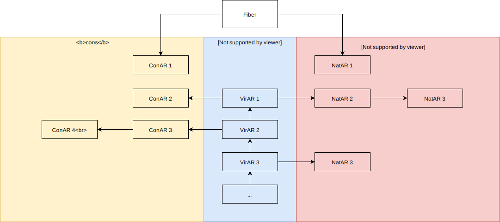
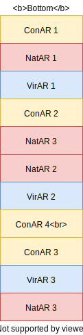
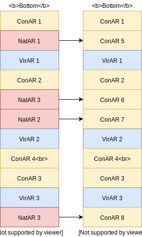

# Native Re-Entry
One of the neat feature's of Ten's runtime implementation is
native function re-entry.  This allows native function callbacks
to be implemented in a way that plays well with fiber yields and
continuations by setting 'checkpoints' before each call or yield
from native code.

The reference manual gives a good explanation of how this aspect
of Ten's API works [here](../manual/the-api.md#5.9.1); this article
will give an overview of how the feature is implemented.

## The AR Stack
Each Ten fiber maintains an AR (Activation Record) stack for keeping
track of the registers associated with a particular function call.
This stack is organized in a somewhat unintuitive way to enable
efficient native function re-entry.

The stack is made up of three types of AR node:

- `VirAR`

  A normal activation record for saving the state of a virtual
  function call.  These are allocated as an actual stack implemented
  as a dynamic array in the each fiber.

- `NatAR`

  An activation record allocated on the native stack for saving
  the state of a native function call.

- `ConAR`

  When a fiber yield occurs all current `NatAR`'s are copied to
  the heap as `ConAR`'s since the `NatAR`'s, allocated on the
  native C stack, will be destroyed in the long jump used to
  implement yields.  These keep track of the state of the
  re-entrant native calls.

The full AR stack is organized as in the following graphic.

The fiber itself maintains a stack of `VirAR` structs in the form of
a dynamic array, and each `VirAR` has a linked list of `NatAR`s and
another of `ConAR`s.  The `ConAR`s represent, and maintain the state
of, native functions that were paused by a yield, and must be re-entered
to finish the call and produce a return value.

The `ConAR`s attached to a `VirAR` are considered to be 'above' the `VirAR`
on the stack, and must be evaluated before the respective `VirAR` can
be popped (setting its registers as the current set).  The `NatAR` list
represents the sub-stack of native function calls made directly above
the respective virtual AR, or made within a `ConAR` evaluation above
the virtual AR.

The top `ConAR` is 'evaluated' by calling back into the native callback
for which the AR was originally created (as a `NatAR`), with the proper
setup to allow the callback to restore its previous state.  The return
values of the top `ConAR` in a sub-stack will be passed as continuation
values to the next re-entry, and so on until all `ConAR`s in a particular
list have been evaluated, and the result left atop the value stack, seen
by subsequent bytecode as the return value of the respective native call.

Besides the `cons` and `nats` list of each `VirAR`, the fiber itself also
maintains its own global `cons` and `nats` lists; for native calls that
occur below (before) any virtual calls (i.e as the entry point to a fiber).

A flattened form of the above stack setup would look like:

## Native State
The portion of Ten's API that accommodates native re-entry is exposed as
two functions.

    long
    ten_seek( ten_State* s, void* ctx, size_t size );

    void
    ten_checkpoint( ten_State* s, unsigned cp, ten_Tup* dst );

The `ten_seek()` function does three things:

1. It lets the runtime know that this native function supports re-entry.
2. If saves and restores the state of a native function call's local data.
3. It returns a checkpoint number, used to restore the program counter.

The `ctx` of size `size`, passed into `ten_seek`, should contain all
mutable state of the function call.  On the first entry into a native
call `ten_seek()` notes the given pointer and size; the `ctx` will be
copied into a heap allocation if a yield occurs within the call.  On
subsequent entries (evaluations of the respective `ConAR`) the `ten_seek()`
function restores the given `ctx` from the previously saved state, and
again takes note of the context's address, in case of another yield.  The
return value of `ten_seek()` should be used by the function to restore
its program counter after a yield; it'll return `-1` for the first entry
into a call, and the last checkpoint seen for subsequent entries, or `-1`
if no checkpoint has yet been seen.

Here's an example, copied directly from the Ten manual:

    ten_Tup
    foo( ten_PARAMS ) {
        // The call context.
        struct {
          int     var1;
          int     var2;
          ten_Tup args;
          ten_Tup rets;
        } ctx;

        // Variable initialization, this should be done for
        // every entry, since the tuple addresses will not
        // persist.
        ten_Var arg1 = { .tup = &ctx.args, .loc = 0 };
        ten_Var arg2 = { .tup = &ctx.args, .loc = 1 };

        ten_Var ret1 = { .tup = &ctx.rets, .loc = 0 };
        ten_Var ret2 = { .tup = &ctx.rets, .loc = 1 };

        ten_Var bar = { .tup = args, .loc = 0 };

        // The goto switch continues the function from right
        // after the block that triggered the previous yield.
        switch( ten_seek( ten, &ctx, sizeof( ctx ) ) ) {
            case 0: goto cp0;
            case 1: goto cp1;
            case 2: goto cp2;
        }

        ... do some  stuff ...

        ten_checkpoint( ten, 0, &ctx.rets );
            ctx.args = ten_pushA( ten, "" );
            ctx.rets = ten_call( ten, &bar, &ctx.args );
        cp0:

        // We can rely on `ctx.rets` having a valid return tuple
        // even if the call was interrupted as Ten will put a
        // proper tuple in the checkpoint's destination location.

        ... do some more stuff ...

        ten_checkpoint( ten, 1, &ctx.rets );
          ctx.args = ten_pushA( ten, "II", 123, 321 );
          ten_yield( ten, &ctx.args );
        cp1:

        ... then do more stuff ...

        ten_checkpoint( ten, 2, &ctx.rets );
          ctx.args = ten_pushA( ten, "" );
          ten_yield( ten, &ctx.args );
        cp2:

        ...
    }

The `ten_checkpoint()` function 'marks' the current location, letting
the runtime know that the function has finished execution up to the
respective point, and latter entries into the call should skip to the
next portion of the callback.  The function expects a tuple pointer, which
must be allocated in the call's `ctx`, and will be modified to reflect
the entry's continuation arguments, which Ten will push to the top of
the value stack before each entry into the call.

## Native Activation Records
When a native function calls back into the Ten runtime to invoke another
function, a `NatAR` is created on the C stack and populated with the
caller's virtual registers, to be restored upon return of the callee.  This
`NatAR` is linked into the `nats` list of the top `VirAR`, or if the `VirAR`
stack is empty, then linked into the fiber's `nats` list.

    struct NatAR {
        AR          base;
        NatAR*      prev;

        char const* file;
        uint        line;

        void*       context;
        size_t      ctxSize;
        uintptr_t   dstOffset;
        long        checkpoint;
    };

The actual registers are saved in the `base`, and `prev` is used
to link the nodes together.  The `file` and `line` fields keep track
of where, in C code, the call was made from; and everything else
is dedicated to maintaining the state of a re-entrant native call.

The `context` and `ctxSize` are set directly from the arguments passed
to `ten_seek()`; or zero initialized if such a call is never made.  A
`NULL` `context` tells Ten that the function isn't re-entrant, so the
runtime shouldn't try to call back into the function if its interrupted,
instead Ten will return an empty tuple `()` on behalf of the callback.

The `dstOffset` is set to `(void*)dst - ctx`, where `dst` is what
was passed to the last call to `ten_checkpoint()`, and `ctx` is the
context passed to `ten_seek()` (or the AR's `context` field).  The
`ten_checkpoint()` function should obviously never be called before
a call to `ten_seek()`.

## Continuation Activation Records
When a yield occurs with a native function call in progress, its respective
`NatAR` is copied onto the heap as a `ConAR`, and its `context` copied to a
respective heap allocation.  Such `ConAR`s at the top of the stack must be
evaluated to produce some form of result (seen as the result of the
respective native function call).

    struct ConAR {
        AR          base;
        ConAR*      prev;

        char const* file;
        uint        line;

        void*       context;
        size_t      ctxSize;
        uintptr_t   dstOffset;
        long        checkpoint;
    };

Newly converted `ConAR`s (converted from `NatAR`s) are pushed to the
topmost `cons` list.  For example a yield with the previous stack
setup would result in:

Upon continuation of a fiber, and before popping a `VirAR` from the AR stack, Ten will evaluate all `ConAR`s at the top of the stack (above the first
`VirAR`), passing the results of each subsequent evaluation as continuation
arguments to the next (put in the `dst` tuple of the last checkpoint).  For
non-re-entrant functions, indicated by a `NULL` context pointer, this
evaluation just pops the `ConAR` from the AR stack, and returns an empty
tuple `()` to the value stack on the function's behalf.  Otherwise the `ConAR`
is popped from the stack to fill the current register set, then the associated
native callback is called to finish execution of the native call; and its
return values left on the stack to serve as continuation arguments for the
next `ConAR` or as the return values for the root level native call.

## Case Study
TODO
